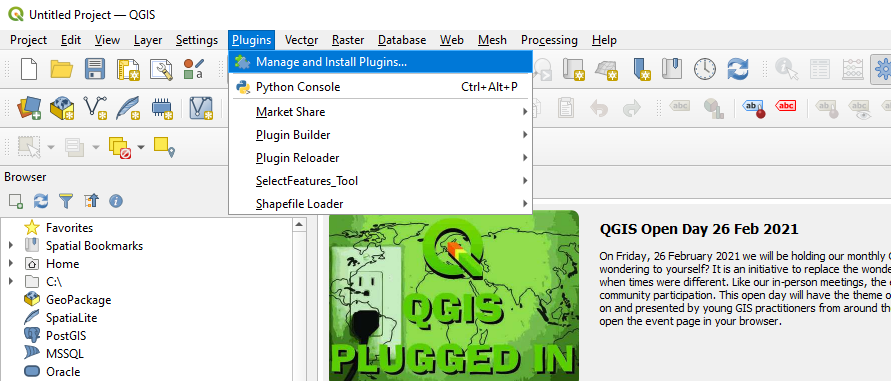

# 5222_final_project
Final for 5222 QGIS choropleth map maker(Project 2 prompt).  

This will make a 5 class Choropleth map given a NUMERIC field.  

\#TODO
In the future there will be more error handling and the ability to change the number of classes or at least give a couple options to the user for number of classes and color schemes.

# User Manual
### Installation  
Run ```python -m pip install -r requirements.txt``` if you run into module errors.  
This should solve any "ModuleNotFoundError: No module named X" errors  


This plugin is installed via the .zip qgis plugin installation like any other plugin.  
## Steps below -  
## Step 0  
Download the most resent zip from the release tab on the right.  

## Step 1  
Click _**plugin menu**_  
  

## Step 2  
Click _**Manage and install plugins...**_  
  

## Step 3  
Click _**Install from Zip**_ and browse to the location of the downloaded zip
  

# Usage  
Clicking the tool icon will prompt you for a folder. When the folder is provided by the user a dropdown menu will be filled with the \*.shp files in that directory.  
Once a file is chosen the user will have to choose a NUMERIC field in the dropdown. Click OK. The plugin will automatically make a 5 class Choropleth map.  
Example shapefiles are in the "examples" directory in this repository.
